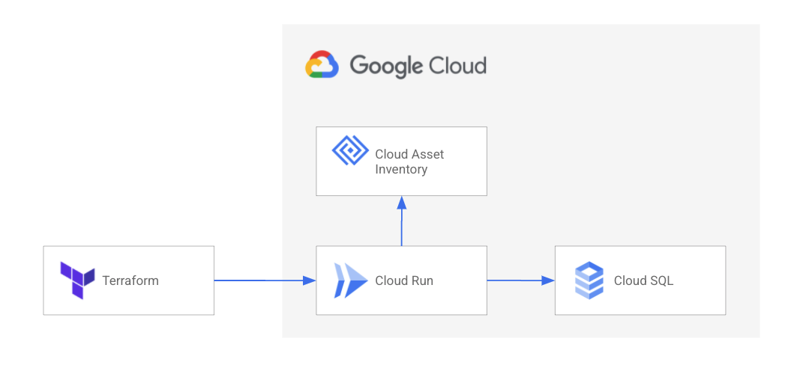
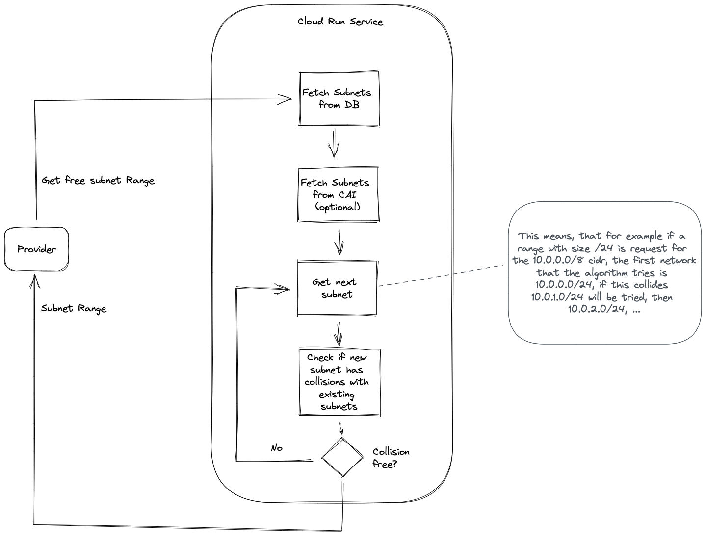

# IPAM Autopilot

> **Fork notice:** This is a Boozt Fashion AB fork of
> [GoogleCloudPlatform/professional-services](https://github.com/GoogleCloudPlatform/professional-services/tree/main/tools/ipam-autopilot),
> maintained at [boozt-platform/ipam-autopilot](https://github.com/boozt-platform/ipam-autopilot).
> See [NOTICE](./NOTICE) and [CHANGES.md](./CHANGES.md) for details.

IPAM Autopilot automatically manages IP ranges for GCP VPCs. It provides a REST API backend deployed on Cloud Run and a Terraform provider for IaC-driven CIDR allocation.

It integrates with Cloud Asset Inventory to discover existing subnets and prevent overlap, even for ranges not registered in IPAM.



---

## Deploying the backend

Use the `modules/ipam-infra` Terraform module to deploy the IPAM backend to GCP:

```hcl
module "ipam" {
  source = "github.com/boozt-platform/ipam-autopilot//modules/ipam-infra?ref=v1.9.0"

  project_id      = "my-project"
  region          = "europe-west1"
  organization_id = "123456789"   # optional — enables CAI integration

  image = "ghcr.io/boozt-platform/ipam-autopilot:latest"  # or booztpl/ipam-autopilot:latest
}

output "ipam_url" {
  value = module.ipam.cloud_run_url
}
```

See [`modules/ipam-infra`](./modules/ipam-infra) for all available variables.

### Key module variables

| Variable | Default | Description |
|---|---|---|
| `project_id` | | GCP project to deploy into |
| `region` | `europe-west1` | GCP region |
| `organization_id` | `""` | Org ID for Cloud Asset Inventory (leave empty to disable) |
| `image` | `ghcr.io/boozt-platform/ipam-autopilot:latest` | Container image |
| `database_tier` | `db-f1-micro` | Cloud SQL machine type |
| `database_deletion_protection` | `true` | Protect database from accidental deletion |
| `cloud_run_ingress` | `INGRESS_TRAFFIC_INTERNAL_LOAD_BALANCER` | Cloud Run ingress setting |
| `cloud_run_allow_unauthenticated` | `false` | Allow unauthenticated access (enable for testing only) |
| `cloud_sql_proxy_image` | `gcr.io/cloud-sql-connectors/cloud-sql-proxy:2.21.2` | Cloud SQL Auth Proxy version |

### Examples

- [`examples/infra`](./examples/infra) — full sandbox deployment with public access for testing

---

## Registering a network

Use the `modules/ipam-network` module to register a VPC network and its top-level IP blocks:

```hcl
terraform {
  required_providers {
    ipam = {
      source  = "boozt-platform/ipam-autopilot"
      version = "~> 1.9"
    }
  }
}

provider "ipam" {
  url = "https://your-ipam-cloud-run-url"
}

module "prod_network" {
  source = "github.com/boozt-platform/ipam-autopilot//modules/ipam-network?ref=v1.9.0"

  domain = {
    name = "prod-vpc"
    cidr = "10.0.0.0/8"
  }
  labels = { env = "prod" }

  networks = {
    "tenant"       = { size = 16 }
    "gke-nodes"    = { size = 16 }
    "gke-pods"     = { size = 16 }
    "gke-services" = { size = 16 }
  }
}

# Allocate a tenant subnet from the tenant block
resource "ipam_ip_range" "my_team" {
  name       = "my-team-prod"
  range_size = 22
  domain     = module.prod_network.domain.id
  parent     = module.prod_network.networks["tenant"].cidr
  labels     = { team = "my-team", env = "prod" }
}
```

See [`modules/ipam-network`](./modules/ipam-network) for all available variables and outputs.

Or manage resources directly without the module:

```hcl
resource "ipam_routing_domain" "prod" {
  name = "prod"
}

resource "ipam_ip_range" "root" {
  name       = "prod-root"
  cidr       = "10.0.0.0/8"
  range_size = 8 # must match the prefix length of cidr
  domain     = ipam_routing_domain.prod.id
}

resource "ipam_ip_range" "gke_nodes" {
  name       = "prod-gke-nodes"
  range_size = 22
  domain     = ipam_routing_domain.prod.id
  parent     = ipam_ip_range.root.cidr
  labels = {
    env     = "prod"
    purpose = "gke-nodes"
  }
}

output "gke_nodes_cidr" {
  value = ipam_ip_range.gke_nodes.cidr
}
```

To read an existing range without allocating:

```hcl
data "ipam_ip_range" "existing" {
  name = "prod-gke-nodes"
}
```

See [`examples/sandbox-gcp-vpc`](./examples/sandbox-gcp-vpc) for a working example.

---

## Authentication

The Terraform provider authenticates against the Cloud Run backend using Google identity tokens obtained from Application Default Credentials (ADC).

**Local development** — run once:

```bash
gcloud auth application-default login
```

**CI/CD** — set the `IPAM_IDENTITY_TOKEN` environment variable to a valid Google identity token:

```bash
export IPAM_IDENTITY_TOKEN=$(gcloud auth print-identity-token \
  --audiences="https://your-ipam-cloud-run-url")
```

**Private Cloud Run (production)** — the Cloud Run service should have `roles/run.invoker` granted to the caller's service account. The provider handles token retrieval automatically from the attached SA.

**Provider configuration:**

```hcl
provider "ipam" {
  url = "https://your-ipam-cloud-run-url"   # or set IPAM_URL env var
}
```

---

## API

All endpoints are available under `/api/v1`:

```
POST   /api/v1/ranges              allocate a new IP range (auto or direct CIDR)
GET    /api/v1/ranges              list all ranges; optional ?name= filter
GET    /api/v1/ranges/:id          get a single range
PUT    /api/v1/ranges/:id          update labels on an existing range (in-place)
DELETE /api/v1/ranges/:id          release a range
POST   /api/v1/ranges/import       bulk-import pre-existing CIDRs (idempotent)

POST   /api/v1/domains             create a routing domain
GET    /api/v1/domains             list all routing domains
GET    /api/v1/domains/:id         get a single routing domain
PUT    /api/v1/domains/:id         update a routing domain
DELETE /api/v1/domains/:id         delete a routing domain

GET    /api/v1/audit?limit=N       last N audit log events (default 100, max 1000)
```

Legacy paths (`/ranges`, `/domains`) are kept for backward compatibility.

---

## Environment variables (backend)

All variables use the `IPAM_` prefix, except OpenTelemetry standard variables.

**Database**

| Variable | Default | Description |
|---|---|---|
| `IPAM_DATABASE_USER` | | MySQL username |
| `IPAM_DATABASE_PASSWORD` | | MySQL password (not used with Cloud SQL IAM auth) |
| `IPAM_DATABASE_HOST` | | MySQL `host:port` or Unix socket path |
| `IPAM_DATABASE_NAME` | | MySQL database name |
| `IPAM_DATABASE_NET` | `tcp` | Network type (`tcp` or `unix`) |
| `IPAM_DISABLE_DATABASE_MIGRATION` | `FALSE` | Set `TRUE` to skip auto-migration on startup |

**Server**

| Variable | Default | Description |
|---|---|---|
| `IPAM_PORT` | `8080` | HTTP listen port |
| `IPAM_LOG_FORMAT` | `json` | Set `text` for human-readable logs |
| `OTEL_EXPORTER_OTLP_ENDPOINT` | | OTLP gRPC endpoint for tracing (e.g. `jaeger:4317`) |

**Features**

| Variable | Default | Description |
|---|---|---|
| `IPAM_CAI_ORG_ID` | | GCP organisation ID for Cloud Asset Inventory integration |
| `IPAM_CAI_DB_SYNC` | `FALSE` | Set `TRUE` to enable DB-backed CAI cache with background sync |
| `IPAM_CAI_SYNC_INTERVAL` | `5m` | Sync interval when `IPAM_CAI_DB_SYNC=TRUE` (Go duration) |
| `IPAM_DISABLE_BULK_IMPORT` | `FALSE` | Set `TRUE` to disable `POST /api/v1/ranges/import` |

**Terraform provider**

| Variable | Default | Description |
|---|---|---|
| `IPAM_URL` | | IPAM API base URL (alternative to `url` in provider config) |
| `IPAM_IDENTITY_TOKEN` | | Identity token for Cloud Run auth; if unset, ADC is used automatically |

---

## Cloud Asset Inventory integration

When `IPAM_CAI_ORG_ID` is set, IPAM Autopilot discovers existing VPC subnets across your GCP organisation via Cloud Asset Inventory and merges them with IPAM allocations before running collision avoidance. This prevents double-allocation even for subnets not registered in IPAM.

**VPC scoping** — Each routing domain has an optional list of VPCs. Only subnets belonging to those VPCs are considered, so allocations for `prod-vpc` are independent of `staging-vpc`.

**VPC name format** — accepts both full resource URLs and short names:

```
https://www.googleapis.com/compute/v1/projects/my-project/global/networks/my-vpc
my-vpc
```

**Two modes**

| Mode | Config | Behaviour |
|---|---|---|
| Live (default) | `IPAM_CAI_ORG_ID` only | CAI API queried on every allocation; always up to date |
| DB sync | `IPAM_CAI_ORG_ID` + `IPAM_CAI_DB_SYNC=TRUE` | Subnets cached in `cai_subnets` table, refreshed every `IPAM_CAI_SYNC_INTERVAL`; fast, no per-request CAI latency |

**Required IAM** - the Cloud Run service account needs `roles/cloudasset.viewer` at the organisation level (granted automatically by `modules/ipam-infra` when `organization_id` is set).

---

## Bulk import

Use `POST /api/v1/ranges/import` to register pre-existing CIDRs without triggering auto-allocation. Recommended when adopting IPAM for a VPC that already has manually-assigned subnets.

```bash
curl -X POST https://YOUR_IPAM_URL/api/v1/ranges/import \
  -H "Authorization: Bearer $(gcloud auth print-identity-token)" \
  -H "Content-Type: application/json" \
  -d '[
    {"name": "gke-nodes", "cidr": "10.1.0.0/22", "domain": "1", "labels": {"env": "prod"}},
    {"name": "gke-pods",  "cidr": "10.2.0.0/16", "domain": "1"}
  ]'
```

The endpoint is idempotent — ranges already present in the same domain are silently skipped. Returns `{ "imported": 2, "skipped": 0, "errors": [] }`.

Set `IPAM_DISABLE_BULK_IMPORT=TRUE` to disable the endpoint in production.

---

## Local development

### Prerequisites

- Docker + Docker Compose
- Go 1.26
- Terraform or OpenTofu

Alternatively, open the repo in VS Code — it includes a [devcontainer](./.devcontainer) with all tools pre-installed.

### Start the stack

```bash
docker compose up --build -d   # MySQL + API (localhost:8080) + Jaeger (localhost:16686)
```

### Common tasks

```bash
make test                # unit tests (container + provider)
make test-integration    # integration tests via testcontainers (requires Docker)
make lint                # golangci-lint
make dev-apply           # build provider binary + tofu apply against docker-compose
make dev-destroy         # tofu destroy local dev resources
```

---

## Subnet selection logic



Given a request for a `/24` within `10.0.0.0/8`, with `10.0.0.0/28` and `10.0.0.16/28` already allocated in IPAM, and `10.0.0.64/26` discovered via CAI — `10.0.0.0/24` would collide, so IPAM Autopilot allocates `10.0.1.0/24`.
